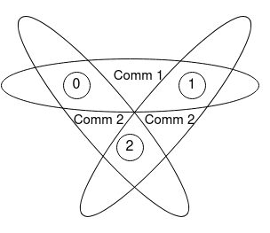

The Basic MPI calls
-----------------------

.. admonition:: Overview
    :class: Overview

    * **Tutorial:** 20 min

        **Objectives:**
            #. Learn six monstly used MPI calls.

MPI can be very easy to use. If your code only needs simple communication patterns, such as point-to-point communication, you can get by with just six MPI calls. These six calls are:

1. **MPI_Init:** Initializes the MPI environment.
2. **MPI_Comm_size:** Returns the total number of processes in a communicator.
3. **MPI_Comm_rank:** Returns the rank of the calling process in a communicator.
4. **MPI_Send:** Sends a message to a specific process.
5. **MPI_Recv:** Receives a message from a specific process.
6. **MPI_Finalize:** Terminates the MPI environment.

.. admonition:: Key MPI call
    :class: hint

    MPI_INIT()

    C Binding:

    .. code-block:: c

        int MPI_Init(int &argc, char &argv)

.. note::
    
    #. **The MPI_Init()** call does not create a process; rather, it initialises the MPI environment, e.g. defines the initial communicator MPI_WORLD_COMM.
    
    #. It must be called before any other MPI function.

Communicator
~~~~~~~~~~~~~~~~~~~
As we saw in the our first MPI call **MPI_Init()**, MPI uses a communicator to define a group of processes that can communicate with each other. 

.. note::
    #. The communicator defines the group of processes for communication.
    #. A communicator must be specified in MPI program as a unit of communication. The default communicator is **MPI_COMM_WORLD**, which includes all processes.
    #. Multiple communicators can be defined, either overlapping or non-overlapping.

Caption: Overlapping communicators between three processes

Basic Communication Management
~~~~~~~~~~~~~~~~~~~~~~~~~~
The basic communication management in MPI is done using the following functions:

.. admonition:: Key MPI call
    :class: hint

    MPI_COMM_SIZE(comm, size)
        IN **comm**: communicator (handle)

        OUT **size**: number of processes in the group of comm (integer)
    C Binding:

    .. code-block:: c

        // determine the number of processes in the group of comm
        int MPI_Comm_size(MPI_Comm comm, int *size)

.. admonition:: Key MPI call
    :class: hint

    MPI_COMM_RANK(comm, rank)
        IN **comm**: communicator (handle)

        OUT **rank**: rank of the calling process in group of comm (integer)
    C Binding:

    .. code-block:: c

        // determine the rank of the calling process in the group of comm
        int MPI_Comm_rank(MPI_Comm comm, int *rank)

"Close" MPI process
~~~~~~~~~~~~~~~~~~~~~~~~~~
Once the MPI program has completed its work, it is important to close the MPI environment. This is done using the **MPI_Finalize()** function.

.. admonition:: Key MPI call
    :class: hint

    MPI_FINALIZE()
    C Binding:

    .. code-block:: c

        int MPI_Finalize()

.. note::
    #. **MPI_Finalize()** cleans up the MPI environment and should be called after all other MPI functions have been called.
    #. However, it does not shut down the processes.
    #. Behaviour could be undefined if called on a process that still participates in communication.
    #. Consider using **MPI_Abort** for error capture.

Combining the basic MPI calls, we can write summarise a MPI program in the following structure:

.. code-block:: c

    #include<stdio.h>
    #include <mpi.h>

    int main(int argc, char *argv[]) {
        int rank, size;
        MPI_Init(&argc, &argv);
        double start_t, end_t;
        start_t =  MPI_Wtime();
        MPI_Comm world = MPI_COMM_WORLD;
        MPI_Comm_size(world, &size);
        MPI_Comm_rank(world, &rank);

        /* main body of code */

        end_t = MPI_Wtime();
        printf("MPI program runtime = %f at rank %d\n", end_t - start_t, rank);
        MPI_Finalize();
        return 0;
    }

.. admonition:: Exercise
    :class: hint

    Review the given program MC_pi.c to understand the structure of a basic MPI program.