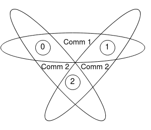

MPI foundations
===============

MPI (Message Passing Interface) is a standard for communication between
processes. Open MPI, MPICH, and Intel MPI are implementations. MPI defines
communication routines; the programmer chooses how to split work and data.
The workshop uses C bindings.

With ``mpiexec -np 4 ./program``, four processes execute the program. In the
single program, multiple data (SPMD) model, each rank selects different work
using its rank number. Each process has its own address space, including when
several processes share one node. Changing a variable on rank 0 does not
change rank 1's copy.

A communicator identifies a group and a communication context. A rank is a
process's position in that group, from zero to ``size - 1``. A process can
have different ranks in different communicators. ``MPI_COMM_WORLD`` contains
the processes in the simple jobs used here; rank 0 is an ordinary process
chosen as root by the program.

   Overlapping groups can communicate in separate contexts.

Strong and weak scaling
-----------------------

.. list-table::
   :header-rows: 1

   * - Experiment
     - Fixed quantity
     - Ideal result as ranks increase
   * - Strong scaling
     - Total work
     - Elapsed time decreases in proportion to rank count.
   * - Weak scaling
     - Work per rank
     - Elapsed time stays constant as total work increases.

For fixed work, speedup is :math:`S_p=T_1/T_p` and efficiency is
:math:`E_p=S_p/p`. Communication, serial work, and imbalance limit these ideals.
For this square-grid problem, keep ``mesh_size`` fixed for strong scaling.
For approximately fixed unknowns per rank, increase the grid dimension as
:math:`N\propto\sqrt{p}`; communication costs may still change.

A brief history
---------------

Standardisation began in 1992. MPI 1.0 appeared in 1994, followed by MPI 1.1
in 1995 and MPI 1.2 in 1997. MPI 2.0 (1997) added parallel I/O, RMA, and dynamic
processes. MPI 1.3 and MPI 2.1 consolidated earlier documents in 2008; MPI 2.2
followed in 2009.

MPI 3.0 (2012) added nonblocking collectives and extended RMA; MPI 3.1 (2015)
added clarifications and nonblocking collective I/O. MPI 4.0 (2021) added large
counts, persistent collectives, partitioned communication, and Sessions.
MPI 4.1 (2023) made clarifications and minor extensions. MPI 5.0 (2025) added
a standard Application Binary Interface (ABI).

See the `MPI Forum release history <https://www.mpi-forum.org/docs/mpi-5.0/mpi50-report/mpi50-report.htm>`_.
The release number of a library such as Open MPI is separate from its supported
MPI standard version. Most routines in these exercises predate MPI 4.0.

.. admonition:: Check your understanding

   If every rank runs the same executable, why can they perform different work?
   Each rank queries its identity and uses it to choose a portion of the data;
   the program supplies the decomposition.
