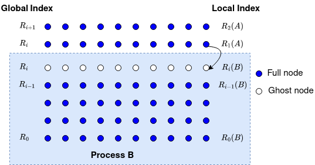

Model Problem
=============

The communication exercises solve a two-dimensional Poisson equation on the
unit square :math:`\Omega=[0,1]^2`:

.. math::

    -\Delta u = 2\pi^2\sin(\pi x)\sin(\pi y) \quad\text{in }\Omega,
    \qquad u=0 \quad\text{on }\partial\Omega.

The exact continuous solution is :math:`u(x,y)=\sin(\pi x)\sin(\pi y)`.
Let :math:`N` (``mesh_size``) include both boundary points in each dimension.
Then :math:`h=1/(N-1)` and there are :math:`(N-2)^2` interior unknowns.
The five-point discretisation gives

.. math::

    \frac{4u_{i,j}-u_{i-1,j}-u_{i+1,j}-u_{i,j-1}-u_{i,j+1}}{h^2}=f_{i,j},
    \qquad i,j=1,\ldots,N-2.

Jacobi iteration computes new values from the previous iteration's neighbours:

.. math::

    u^{(k+1)}_{i,j}=\frac{h^2f_{i,j}+u^{(k)}_{i-1,j}+u^{(k)}_{i+1,j}
    +u^{(k)}_{i,j-1}+u^{(k)}_{i,j+1}}{4}.

Each MPI rank owns a slab of rows plus top and bottom ghost rows. Exchange
neighbouring owned rows to refresh the ghosts before using them in the stencil.
With nonblocking communication, interior computation can overlap the exchange.
The top rank owns any interior rows left over after division by the rank count.

The programs run for a fixed number of iterations and report the scaled
Euclidean residual :math:`h^2\|Au-b\|_2`, where :math:`b` includes boundary
contributions (zero here). For the discrete solution :math:`Au^\ast=b`, define
:math:`e=u-u^\ast` and :math:`r=b-Au`. Then :math:`Ae=-r`, hence
:math:`\|e\|\leq\|A^{-1}\|\|r\|`. This algebraic error is separate from
the error introduced by discretising the continuous equation.

For an 18 by 18 grid and 10 iterations, the expected printed residual is
approximately ``0.488953`` with 1, 2, or 4 ranks. See the Day 1 notebook for
the matrix formulation and further validation guidance.

Local row ownership
-------------------

For ``R = *ptr_rows``, the local layout is:

.. list-table::
   :header-rows: 1

   * - Local row
     - Meaning
     - Communication
   * - ``0``
     - Bottom ghost or physical boundary
     - Receive from lower neighbour
   * - ``1``
     - First owned row
     - Send to lower neighbour
   * - ``2`` through ``R-3``
     - Owned rows independent of incoming ghosts
     - Compute while transfers are pending
   * - ``R-2``
     - Last owned row
     - Send to upper neighbour
   * - ``R-1``
     - Top ghost or physical boundary
     - Receive from upper neighbour

   Ghost rows hold copies of neighbouring owned values.

Only columns ``1`` through ``mesh_size-2`` are updated. Missing neighbours use
``MPI_PROC_NULL`` in point-to-point exchanges; the receive leaves the physical
boundary unchanged. At least two owned interior rows per rank are required.

Exchange halos again after the last Jacobi update before evaluating the
residual, so owned and ghost values belong to the same final iterate.
For ``300 1000 Jacobi``, the reference scaled residual is about ``0.031236``.
Changing mesh size or iteration count changes this expected value.
