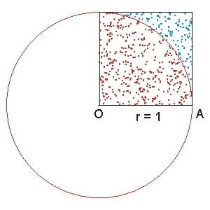

Example: Monte-carlo Approximation of Pi
------------------

.. admonition:: Overview
    :class: Overview

    * **Tutorial:** 20 min

        **Objectives:**
            #. Learn how to use MPI to approximate Pi using the Monte Carlo method.

**Monte Carlo Method:** The Monte Carlo method is a statistical technique used to estimate the value of an unknown quantity using random sampling.
In this example, we generate :math:`N` random sampling points within a square, and count the number :math:`h` of samples that fall in the unit circle. Then the approximation of :math:`\pi` is given by: :math:`4h/N`.

A serial implementation of the Monte Carlo method to approximate Pi may look like the following:

.. code-block:: c
    :linenos:

    seed = 1; // seed for random number generator 
    for (i=0; i<N; i++) {
        x = (double)rand_r(&seed)/(double)RAND_MAX; // RAND_MAX to normalise 
        y = (double)rand_r(&seed)/(double)RAND_MAX;

        if (x*x + y*y <= 1.0) h++; 
    }

**Parallel Monte Carlo Pi Approximation:** To parallelise the Monte Carlo method, we can divide the work among multiple processors. Each processor generates a subset of the total random samples and counts the number of samples that fall within the unit circle. The final approximation of Pi is obtained by summing the counts from all processors and dividing by the total number of samples. 

Our first MPI code will look like this:

.. code-block:: c
    :linenos:

    #include<mpi.h>

    int rank, size;
    int count=0, count_tot=0;
    MPI_Comm_rank(MPI_COMM_WORLD, &rank); // get the rank of the process
    MPI_Comm_size(MPI_COMM_WORLD, &size); // get the total number of processes

    int start = rank * N /size; // the start index of the samples for this process
    int end = (rank+1) * N /size; // the end index of the samples for this process

    for (i=start; i<end; i++) {
        x = (double)rand_r(&seed)/(double)RAND_MAX; 
        y = (double)rand_r(&seed)/(double)RAND_MAX;

        if (x*x + y*y <= 1.0) count++; 

        // sum the counts from all processes        
        MPI_Reduce(*count, &count_tot, 1, MPI_INT, MPI_SUM, 0, MPI_COMM_WORLD);
    }

.. note::
    The user organises the copies of data for each parallel process.

In 

