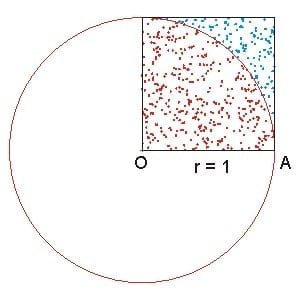

Monte Carlo approximation of pi
===============================

Generate points uniformly in the unit square and count the ones inside the
quarter-circle :math:`x^2+y^2\leq1`. For :math:`H` hits out of :math:`N` samples,
:math:`\pi\approx4H/N`.

   Counting random samples estimates the circle's area.

Rank ``rank`` handles the integer range from ``rank * N / size`` to
``(rank + 1) * N / size`` (exclusive). Initialise each rank's random seed once
before its loop, then advance the generator for each sample. Resetting the
seed on every iteration repeats the same samples.

After local sampling, all ranks call ``MPI_Reduce`` once with ``MPI_SUM``.
Rank 0 converts the combined hit count into an estimate of pi. Sampling is
independent across ranks; only the final count needs communication.

.. _exercise-1-1:

Exercise 1.1: Read and run your first MPI program
-------------------------------------------------

.. admonition:: STOP HERE -- Exercise 1.1
   :class: important

   **Open and read:** :download:`day1/MC_pi.c <../../../../day1/MC_pi.c>` No edits are required.

   #. Locate initialisation, rank/size queries, and finalisation.
   #. Explain the sample ranges and seed placement.
   #. Identify the local count and final reduction.
   #. Predict which ranks produce each printed line.

Run from ``day1/``:

.. code-block:: bash

    make MC
    mpiexec -np 4 ./MC_pi

**Checkpoint:** the program finishes, rank 0 reports an estimate near pi,
and every rank reports a runtime. Estimates and print order can vary.
Continue to :doc:`model_problem`.
