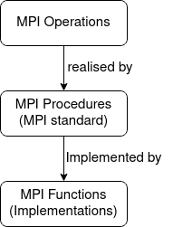
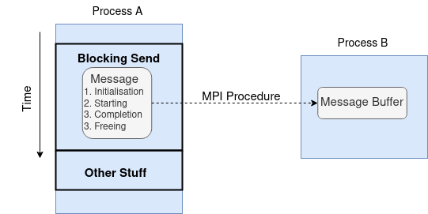
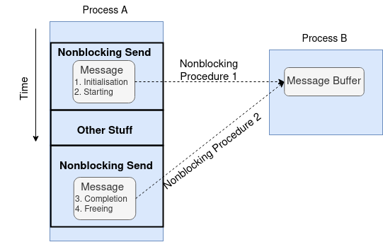
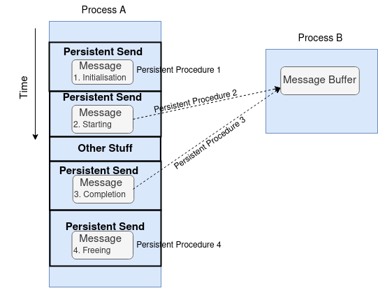
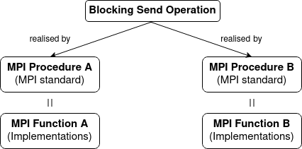
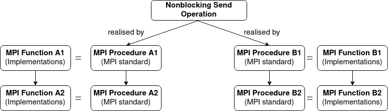

MPI Semantics
---------------

.. admonition:: Overview
   :class: Overview

    * **Tutorial:** 20 min

        **Objectives:**
            #. Learn the semantics of MPI.

To help us understand and better use MPI, we get into the details of its semantics. Fair warning ahead, this is a bit of a dry topic and it does get tedious. You can skip this section if you just want pick up MPI functions and use them straightaway, but recommend you to go through this section to acquire a more in-depth understanding of MPI.

We discuss the semantics of MPI with the structure illustrated in the following diagram:

MPI Operations
----------------
First, we introduce the concept of MPI operations.

.. admonition:: Definition

    An **MPI operation** is a sequence of steps performed by the MPI library to establish and enable data transfer and/or synchronishation. It consists of four stages: **initialisation**, **starting**, **completion**, and **freeing**. An MPI operation is implemented as a set of one or more MPI procedures. 

The main MPI operations are: **Blocking Operations**, **Non-blocking Operations**, **Collective Operations**, and **Persistent Operations**. We will discuss each of these in detail in the upcoming sections.

.. note::
    An MPI operation describes the property of a class of data transfer mechanism but does not define a unique MPI procedure.

The four stages of an MPI operation are:

1. **initialisation**: Hands over the argument list to the operation but not the content of the data buffers.
2. **starting**: Hands over the control of the data buffers, if any, to the associated operation.
3. **completion**: Returns control of the content of the data buffers and indicates that output buffers and arguments, if any, have been updated.
4. **freeing**: Returns control of the rest of the argument list.

We can apply these stages to define the four aforementioned MPI operations.

.. admonition:: Definition

    A **blocking operation** is when the four stages are combined into a single procedure call.

An example is the blocking send operation is the MPI procedure `MPI_SEND`.

 
The send operation is blocking at process A. 

.. admonition:: Definition

    A **non-blocking operation** is when the the **initialisation** and **starting** stages are combined into a single nonblocking procedure call, and the **completion** and **freeing** stages are combined into another single procedure call.

The send operation is non-blocking at process A.

.. admonition:: Definition
    ::class: hint
    
    A **persistent operation** is when there is a single procedure for each of the four stages of the operation.

The send operation is persistent at process A.

MPI Procedures
----------------
We now understand the MPI operations are realised by MPI procedures, we can formally introduce the concept of MPI procedures.

.. admonition:: Definition

    An **MPI procedure** describes functionalities and are specified using a language-independent notation. An MPI operation-related procedure implements at least a part of stage of an MPI operation.

.. admonition:: Example
    :class: hint

    MPI_SEND, MPI_PROBE

There for more than 400 MPI procedures in MPI Standard 4.0. We use all capital letters to denote MPI procedures, e.g., `MPI_SEND`.

.. note::

    #. All MPI procedures can either be **local** or **non-local**, depending on whether its completion requires calls on another MPI process. 
    #. An MPI operation can be realised by different MPI procedures. For example, a block send operation can be realised by different mode such as `MPI_SEND`, `MPI_SSEND`, `MPI_BSEND`, and `MPI_RSEND`.

MPI Functions
----------------

.. admonition:: Definition
    :class: hint

    An **MPI function** is a language-specific binding of an MPI procedure. It is a function that can be called from a program written in a specific language, e.g., C, Fortran. 

.. admonition:: Example
    :class: hint

    MPI_Send, MPI_Probe

Note that to distinguish betwee MPI procedure and MPI function, the MPI functions use lower case.

We summarise the semantics with two diagrams:

Blocking send operation realised by two different MPI procedures

Non-blocking send operation realised by two different groups of MPI procedures, each group consists of two MPI procedures.