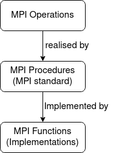

Operations, messages, and completion
====================================

An operation describes the whole communication activity; an MPI procedure
specifies an action, and its C binding gives the callable spelling, such as
``MPI_Send``. The four conceptual stages are binding arguments, starting,
completing, and releasing resources.

.. list-table::
   :header-rows: 1

   * - Form
     - Bind/start
     - Complete
     - Release
   * - Blocking
     - ``MPI_Send`` or ``MPI_Recv``
     - Before the call returns
     - Handled by the call
   * - Nonblocking
     - ``MPI_Isend`` or ``MPI_Irecv``
     - Wait or a test reporting completion
     - Ordinary request released on completion
   * - Persistent
     - Initialise once; start each exchange
     - Wait or a test reporting completion
     - Explicitly free after final use

   Different interfaces combine or separate the operation stages.

Blocking describes completion for the caller, not a barrier across all ranks.
A local procedure can complete independently of another rank's participation;
a nonlocal procedure may require it. A standard send can depend on the peer
posting a receive.

Data and envelope
-----------------

A message's data are described by a buffer address, count, and datatype.
Its envelope includes source, destination, tag, and communicator. A receive
must match a message addressed to it in the same communication context.
``MPI_ANY_SOURCE`` and ``MPI_ANY_TAG`` are receive-side wildcards.

Counts measure datatype elements, not bytes: ``mesh_size`` values of
``MPI_DOUBLE`` describe one row of doubles. The receiver must supply enough
capacity and compatible element types. Derived datatypes describe memory
layouts; they do not create new C language types.

After a completed receive, use ``status.MPI_SOURCE`` and ``status.MPI_TAG``
to identify the message and ``MPI_Get_count`` for its element count. Use
``MPI_STATUS_IGNORE`` when these details are not needed. Check a routine's
return value for an error code when using a returning error handler; do not
use ``status.MPI_ERROR`` as the error result of ``MPI_Recv``.

**Check:** can matching tags connect messages on different communicators?
No: the communication context is part of matching.

Continue to :doc:`../Topic_two/p2p_comm` for call signatures, parameter tables,
and the communication exercises.
