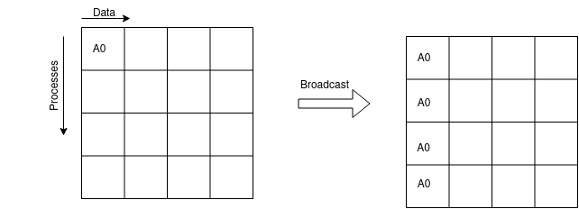
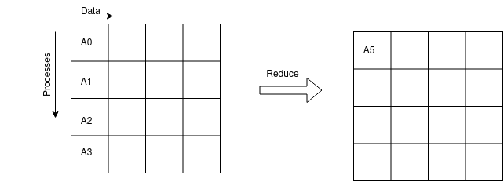
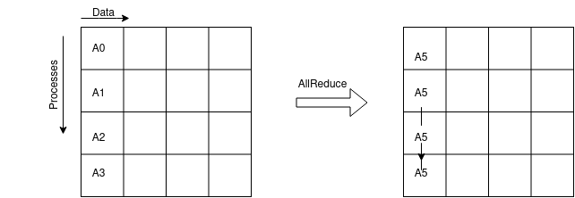

Collective communication
========================

A collective involves the participating group of a communicator. In these
intracommunicator examples, every rank calls it, including the root.

.. list-table::
   :header-rows: 1

   * - Intent
     - Routine
     - Result
   * - Copy the root data to everyone
     - ``MPI_Bcast``
     - Same data on every rank
   * - Distribute separate chunks
     - ``MPI_Scatter``
     - One chunk per rank
   * - Collect separate chunks
     - ``MPI_Gather``
     - Contributions at root, in rank order
   * - Combine values at root
     - ``MPI_Reduce``
     - Root gets sum, maximum, or another reduction
   * - Combine values everywhere
     - ``MPI_Allreduce``
     - All ranks get the reduced result
   * - Collect chunks everywhere
     - ``MPI_Allgather``
     - All ranks get every contribution
   * - Exchange a chunk with each peer
     - ``MPI_Alltoall``
     - One chunk from each peer
   * - Compute prefixes
     - ``MPI_Scan``
     - Rank r gets a reduction over ranks 0 through r
   * - Wait for group participation
     - ``MPI_Barrier``
     - No rank returns until all have entered

Participation and ordering
--------------------------

#. Call matching collectives in the same order on all ranks of the communicator.
#. Agree on root and communicator for rooted operations; use matching type
   signatures and the counts required by the routine.
#. Put root-only processing around the result, not around the collective call.
#. A blocking collective is not necessarily a barrier. Its local completion
   does not require every peer to have returned.

``MPI_Allreduce`` and ``MPI_Alltoall`` have different purposes even though every
rank participates. See the `collective correctness rules
<https://www.mpi-forum.org/docs/mpi-4.1/mpi41-report/node172.htm>`_.

   The solvers broadcast validated input arguments.

   A reduction produces one combined result at the root.

   Use allreduce when every rank needs the result, such as a stopping decision.

The global residual
-------------------

Each rank computes a sum of squares over its owned interior nodes:

.. math::

    q_r=\sum_{(i,j)\text{ owned by rank }r}[h^2(Au-b)_{i,j}]^2,
    \qquad R=\sqrt{\sum_r q_r}.

Sum squares first, then take one square root. Summing local norms would
produce a different quantity. The routine is named ``local_L2_residual``:

.. code-block:: c

    double residual = local_L2_residual(ptr_rows, mesh_size, space,
                                       &submesh[0][0], &subrhs[0][0]);
    double total;
    MPI_Reduce(&residual, &total, 1, MPI_DOUBLE, MPI_SUM, 0, world);
    if (rank == 0) {
        total = sqrt(total);
    }

Other predefined operators include ``MPI_MAX``, ``MPI_MIN``, ``MPI_PROD``,
``MPI_MAXLOC``, and ``MPI_MINLOC``; the last two use compatible pair datatypes.

Gather preserves the contributions
----------------------------------

.. code-block:: c

    int MPI_Gather(const void *sendbuf, int sendcount, MPI_Datatype sendtype,
                   void *recvbuf, int recvcount, MPI_Datatype recvtype,
                   int root, MPI_Comm comm);

For one double per rank, root allocates ``cells`` doubles but specifies
``recvcount = 1``: it is the count from each rank, not the total. Contributions
are stored in rank order, including root's own contribution. The receive
buffer is ignored on nonroot ranks, where it may be ``NULL``.

Floating-point addition is not associative. For example:

.. code-block:: python

    a, b, c = 1e16, -1e16, 1.0
    print((a + b) + c)  # 1.0
    print(a + (b + c))  # 0.0

A reduction may combine values in a tree. Gather lets root sum in a chosen
rank order for this fixed decomposition. It does not guarantee identical bits
across rank counts or compilers: local sums can change. Compare results using
numerical tolerances. Gathering also adds root storage and summation work.

Blocking, nonblocking, and persistent forms
-------------------------------------------

For example, ``MPI_Bcast`` completes locally before returning,
``MPI_Ibcast`` initiates and returns a request, and ``MPI_Bcast_init`` creates
a persistent request. Persistent collectives were added in MPI 4.0.
The exercise uses blocking gather; participation and ordering rules still
apply to the other forms.

.. _exercise-2-1:

Exercise 2.1: Gather and sum residuals
--------------------------------------

.. admonition:: STOP HERE -- Exercise 2.1
   :class: important

   **Edit:** :download:`day2/laplace_mpi_collective.c <../../../../day2/laplace_mpi_collective.c>`

   #. Find the ``MPI_Gather`` TODO after the final halo exchange.
   #. Compute the local contribution with ``local_L2_residual``. Every rank must call ``MPI_Gather``.
   #. On rank 0, allocate one double per rank, sum in rank order, then take one square root and print.

Save your changes, then run from ``day2/``:

.. code-block:: bash

    make collective
    mpiexec -np 4 ./laplace_mpi_collective 300 1000 Jacobi

**Checkpoint:** Rank 0 reports about ``0.031236``; all ranks finish. Continue to the RMA section.

Compare your attempt with :download:`the reference solution <../../../../day2/solution/laplace_mpi_collective.c>`.
