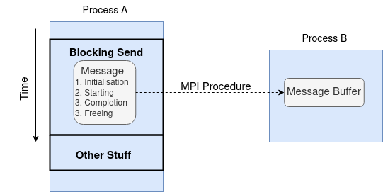
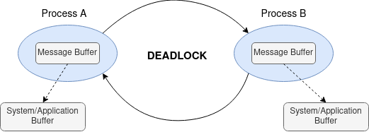
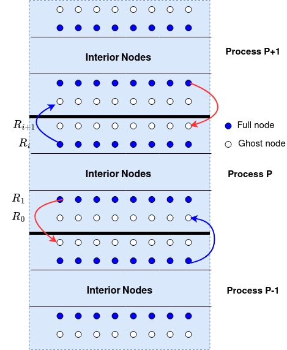
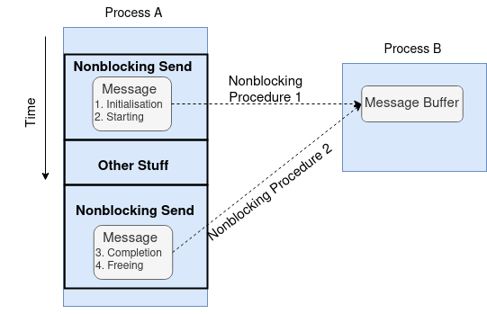
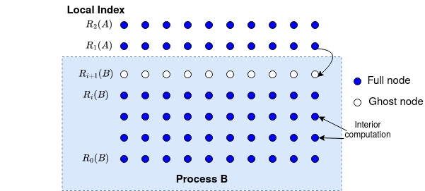
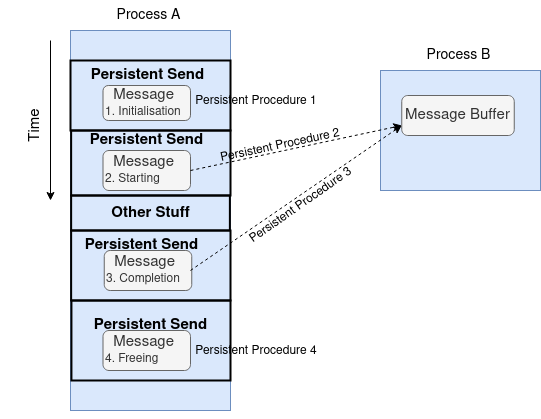

Point-to-point communication
============================

Blocking communication
----------------------

A completed send permits reuse of its buffer; it does not necessarily mean
the receiver has completed its receive. A completed receive makes the incoming
data available in the receive buffer.

   The blocking-send diagram supplied with the workshop slides.

.. list-table::
   :header-rows: 1

   * - Send mode
     - Routine
     - Requirement
   * - Standard
     - ``MPI_Send``
     - May buffer or wait for a matching receive; never depend on buffering.
   * - Buffered
     - ``MPI_Bsend``
     - Provide an attached buffer with enough space, including MPI overhead.
   * - Synchronous
     - ``MPI_Ssend``
     - Completion requires a matching receive to have started.
   * - Ready
     - ``MPI_Rsend``
     - The matching receive must already be posted.

All modes can match ``MPI_Recv``. Both functions return an error code.

MPI_Send arguments
~~~~~~~~~~~~~~~~~~

.. code-block:: c

    int MPI_Send(const void *buf, int count, MPI_Datatype datatype,
                 int dest, int tag, MPI_Comm comm);

.. list-table::
   :header-rows: 1

   * - Argument
     - C type
     - Meaning
     - Example
   * - ``buf``
     - ``const void *``
     - Address of the data to send.
     - ``outgoing``
   * - ``count``
     - ``int``
     - Number of datatype elements to send; must be nonnegative.
     - ``16 * 1024 * 1024``
   * - ``datatype``
     - ``MPI_Datatype``
     - MPI description of each element's type and memory layout.
     - ``MPI_BYTE``
   * - ``dest``
     - ``int``
     - Destination rank in the communicator.
     - ``peer``
   * - ``tag``
     - ``int``
     - Nonnegative message label used for matching.
     - ``0``
   * - ``comm``
     - ``MPI_Comm``
     - Communication context in which the ranks exchange messages.
     - ``MPI_COMM_WORLD``

MPI_Recv arguments
~~~~~~~~~~~~~~~~~~

.. code-block:: c

    int MPI_Recv(void *buf, int count, MPI_Datatype datatype,
                 int source, int tag, MPI_Comm comm, MPI_Status *status);

.. list-table::
   :header-rows: 1

   * - Argument
     - C type
     - Direction
     - Meaning
     - Example
   * - ``buf``
     - ``void *``
     - Output data
     - Address of writable storage for the received message.
     - ``incoming``
   * - ``count``
     - ``int``
     - Input
     - Maximum number of datatype elements the buffer can hold; must be nonnegative.
     - ``16 * 1024 * 1024``
   * - ``datatype``
     - ``MPI_Datatype``
     - Input
     - Type and memory layout of receive-buffer elements.
     - ``MPI_BYTE``
   * - ``source``
     - ``int``
     - Input
     - Sender's rank, or ``MPI_ANY_SOURCE``.
     - ``peer``
   * - ``tag``
     - ``int``
     - Input
     - Message label to match, or ``MPI_ANY_TAG``.
     - ``0``
   * - ``comm``
     - ``MPI_Comm``
     - Input
     - Matching communication context; has no wildcard.
     - ``MPI_COMM_WORLD``
   * - ``status``
     - ``MPI_Status *``
     - Output information
     - Storage for message details, or ``MPI_STATUS_IGNORE`` to discard them.
     - ``&status`` after declaring ``MPI_Status status;``

The example values above match the 16 MiB deadlock program. ``MPI_Send`` has six
inputs. For ``MPI_Recv``, supply writable storage for the output data and a
status object (or ``MPI_STATUS_IGNORE``). Its count is a capacity, not the
number of values actually received.

References: `MPI_Send <https://docs.open-mpi.org/en/v5.0.x/man-openmpi/man3/MPI_Send.3.html>`_
and `MPI_Recv <https://docs.open-mpi.org/en/v5.0.x/man-openmpi/man3/MPI_Recv.3.html>`_.

.. _exercise-1-2:

Exercise 1.2: Diagnose and fix a deadlock
-----------------------------------------

   Send-first ordering can create a circular wait.

.. admonition:: STOP HERE -- Exercise 1.2
   :class: important

   **Open:** :download:`day1/mpi_deadlock.c <../../../../day1/mpi_deadlock.c>` Run it unchanged first.

   #. Observe the output and explain where each rank is waiting.
   #. Replace the consecutive send and receive with ``MPI_Sendrecv``.
   #. Save, rebuild, and rerun; both ranks should print a received-message line.

The source uses separate static buffers of 16 MiB:

.. literalinclude:: ../../../../day1/mpi_deadlock.c
   :language: c

Run from ``day1/`` with two allocated CPUs:

.. code-block:: bash

    mpicc -Wall -Wextra -o mpi_deadlock mpi_deadlock.c
    timeout --kill-after=2s 5s mpiexec -np 2 ./mpi_deadlock

**First-run checkpoint:** two ``sending`` lines and no ``received`` lines are
consistent with the expected deadlock. The prints occur before ``MPI_Send``;
they do not show send completion. The timeout stops the hung job after five
seconds, with a two-second forced-cleanup grace period. Its nonzero exit is
expected for this run.

Small messages may fit internal buffers and hide this error. A 16 MiB message
commonly exposes it, but the threshold depends on the active transport and
configuration. Completion of this unsafe program on one system does not make
the ordering portable.

After attempting the fix, compare with:

.. code-block:: c

    MPI_Sendrecv(outgoing, MESSAGE_BYTES, MPI_BYTE, peer, 0,
                 incoming, MESSAGE_BYTES, MPI_BYTE, peer, 0,
                 MPI_COMM_WORLD, MPI_STATUS_IGNORE);

**Final checkpoint:** both ranks print ``received the message`` and finish
before the timeout. Explain how the combined call removes the circular wait.

Halo exchange
-------------

Each rank sends its first and last owned rows to neighbours and receives
into the bottom and top ghosts. Match neighbours, tags, counts, and types.
At physical edges, ``MPI_PROC_NULL`` lets the chain of blocking operations
progress. This argument would change for a ring of ranks.

   Each rank has two outgoing and two incoming halo messages.

.. _exercise-1-3:

Exercise 1.3: Complete the blocking halo exchange
-------------------------------------------------

.. admonition:: STOP HERE -- Exercise 1.3
   :class: important

   **Edit:** :download:`day1/laplace_mpi_blocking.c <../../../../day1/laplace_mpi_blocking.c>`

   #. Find the TODO for the ``lowertag`` messages inside the loop.
   #. Receive the bottom ghost row from ``lower`` and send the top owned row to ``higher``.
   #. Check that the ordering progresses at both physical edges; retain the supplied Jacobi update.

Save your changes, then run from ``day1/``:

.. code-block:: bash

    make blocking
    mpiexec -np 4 ./laplace_mpi_blocking 300 1000 Jacobi

**Checkpoint:** The exchange finishes and the final residual is approximately ``0.031236``. Then continue to nonblocking communication.

Compare your attempt with :download:`the reference solution <../../../../day1/solution/laplace_mpi_blocking.c>`.

Nonblocking communication
-------------------------

``MPI_Isend`` and ``MPI_Irecv`` initiate transfers and return request handles.
Returning from initiation does not establish completion. Keep send buffers
allocated and unchanged, and do not read or write receive buffers, until the
corresponding operations complete. Other independent work can proceed.

   Separate initiation from completion.

MPI_Isend arguments
~~~~~~~~~~~~~~~~~~~

.. code-block:: c

    int MPI_Isend(const void *buf, int count, MPI_Datatype datatype,
                  int dest, int tag, MPI_Comm comm, MPI_Request *request);

.. list-table::
   :header-rows: 1

   * - Argument
     - C type
     - Direction
     - Meaning
     - Example from the halo exchange
   * - ``buf``
     - ``const void *``
     - Input data
     - Address of the data to send.
     - ``submesh[1]``
   * - ``count``
     - ``int``
     - Input
     - Number of datatype elements to send; nonnegative.
     - ``mesh_size``
   * - ``datatype``
     - ``MPI_Datatype``
     - Input
     - Element type and memory layout.
     - ``MPI_DOUBLE``
   * - ``dest``
     - ``int``
     - Input
     - Destination rank in the communicator.
     - ``lower``
   * - ``tag``
     - ``int``
     - Input
     - Nonnegative message label for matching.
     - ``highertag``
   * - ``comm``
     - ``MPI_Comm``
     - Input
     - Communication context.
     - ``world``
   * - ``request``
     - ``MPI_Request *``
     - Output handle
     - Address where MPI stores the handle used to track completion.
     - ``&bottom_bnd_requests[1]``

MPI_Irecv arguments
~~~~~~~~~~~~~~~~~~~

.. code-block:: c

    int MPI_Irecv(void *buf, int count, MPI_Datatype datatype,
                  int source, int tag, MPI_Comm comm, MPI_Request *request);

.. list-table::
   :header-rows: 1

   * - Argument
     - C type
     - Direction
     - Meaning
     - Example from the halo exchange
   * - ``buf``
     - ``void *``
     - Output data, on completion
     - Address of writable receive storage.
     - ``submesh[*ptr_rows - 1]``
   * - ``count``
     - ``int``
     - Input
     - Maximum number of datatype elements to receive; nonnegative.
     - ``mesh_size``
   * - ``datatype``
     - ``MPI_Datatype``
     - Input
     - Receive-element type and memory layout.
     - ``MPI_DOUBLE``
   * - ``source``
     - ``int``
     - Input
     - Sender's rank, or ``MPI_ANY_SOURCE``.
     - ``upper``
   * - ``tag``
     - ``int``
     - Input
     - Message label to match, or ``MPI_ANY_TAG``.
     - ``highertag``
   * - ``comm``
     - ``MPI_Comm``
     - Input
     - Matching communication context.
     - ``world``
   * - ``request``
     - ``MPI_Request *``
     - Output handle
     - Address where MPI stores the receive request handle.
     - ``&top_bnd_requests[0]``

The examples use the starter's top/bottom request arrays and ``world``
communicator. The integer return value is an error code; MPI stores the
request handle through the final pointer argument. ``MPI_Irecv`` provides
status later through completion calls, not at initiation.

References: `MPI_Isend <https://docs.open-mpi.org/en/v5.0.x/man-openmpi/man3/MPI_Isend.3.html>`_
and `MPI_Irecv <https://docs.open-mpi.org/en/v5.0.x/man-openmpi/man3/MPI_Irecv.3.html>`_.

.. list-table::
   :header-rows: 1

   * - Completion call
     - Meaning
   * - ``MPI_Wait(&request, &status)``
     - Wait for one operation.
   * - ``MPI_Waitall(n, requests, statuses)``
     - Wait for all listed operations.
   * - ``MPI_Test(&request, &flag, &status)``
     - Return immediately; flag reports completion.
   * - ``MPI_Testall(n, requests, &flag, statuses)``
     - Flag reports whether all listed operations completed.

.. code-block:: c

    int MPI_Test(MPI_Request *request, int *flag, MPI_Status *status);

The return code is not the completion flag. Successful completion consumes an
ordinary nonpersistent request and sets its handle to ``MPI_REQUEST_NULL``.

In the Jacobi solver, post the four transfers, run ``Jacobi_int`` into
``submesh_new``, complete communication, then update the edge rows. Complete
both sends as well as receives before copying the new values into ``submesh``.
Nonblocking calls make overlap possible; actual speedup depends on MPI progress,
independent work, and the machine.

   Interior computation can proceed while ghost rows are in transit.

.. _exercise-1-4:

Exercise 1.4: Combine the nonblocking requests
----------------------------------------------

.. admonition:: STOP HERE -- Exercise 1.4
   :class: important

   **Edit:** :download:`day1/laplace_mpi_nonblocking.c <../../../../day1/laplace_mpi_nonblocking.c>`

   #. Replace the separate request groups with one four-request array and update all four communication calls.
   #. Keep ``Jacobi_int`` between initiation and completion. Replace the split test/wait branches with one ``MPI_Waitall`` followed by both edge updates.
   #. Remove both TODOs and redundant declarations. Retain the final copy into the original mesh.

Save your changes, then run from ``day1/``:

.. code-block:: bash

    make nonblocking
    mpiexec -np 4 ./laplace_mpi_nonblocking 300 1000 Jacobi

**Checkpoint:** The residual matches the blocking result (about ``0.031236``). Explain why both sends must finish before overwriting outgoing rows.

Compare your attempt with :download:`the reference solution <../../../../day1/solution/laplace_mpi_nonblocking.c>`.

Persistent communication
------------------------

Repeated halo exchanges use the same addresses, neighbours, counts, types,
and tags. Persistent requests bind these arguments once:

.. code-block:: text

    MPI_Send_init / MPI_Recv_init -> inactive request
    MPI_Start / MPI_Startall      -> active request
    MPI_Wait / completing test    -> inactive request (can restart)
    MPI_Request_free             -> release after final use

   Reuse the communication description across iterations.

Both sends and receives can be persistent. Complete an active request before
restarting it. Completion makes it inactive instead of freeing it. Free every
handle individually after its final completion.

Buffer addresses remain fixed after initialisation. The solver copies updated
values into the original buffers; swapping pointers would need requests bound
to the alternate addresses. Persistent communication can reduce setup overhead,
not the amount of data exchanged.

.. _exercise-1-5:

Exercise 1.5: Reuse persistent requests
---------------------------------------

.. admonition:: STOP HERE -- Exercise 1.5
   :class: important

   **Edit:** :download:`day1/laplace_mpi_persistent.c <../../../../day1/laplace_mpi_persistent.c>`

   #. Complete the initialisation TODO before the loop using ``MPI_Send_init`` and ``MPI_Recv_init``.
   #. Start all requests each iteration and retain the supplied completion checks and waits.
   #. Replace the final TODO by freeing every request after its last completion.

Save your changes, then run from ``day1/``:

.. code-block:: bash

    make persistent
    mpiexec -np 4 ./laplace_mpi_persistent 300 1000 Jacobi

**Checkpoint:** The residual is about ``0.031236``. Identify the calls executed once and those executed each iteration. Continue with Day 2 collectives.

Compare your attempt with :download:`the reference solution <../../../../day1/solution/laplace_mpi_persistent.c>`.
